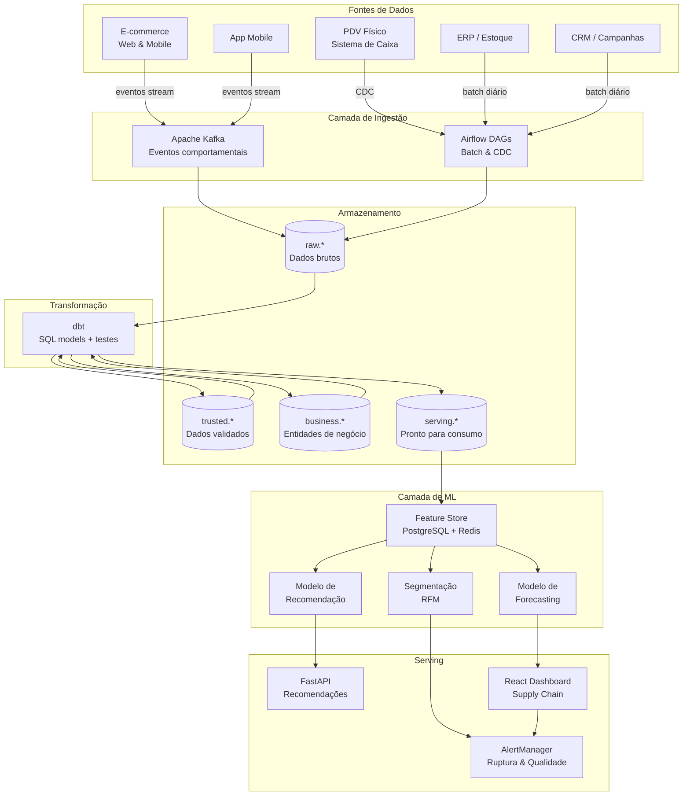

# Arquitetura Geral — Plataforma de Dados para Retail de Beleza

Visão de alto nível dos componentes e suas responsabilidades na plataforma.

---

## Diagrama de Arquitetura

---

## Responsabilidades por Componente

| Componente | Responsabilidade | Tecnologia |
|---|---|---|
| **Kafka** | Barramento de eventos comportamentais em tempo quase real | Apache Kafka |
| **Airflow DAGs** | Orquestração de pipelines batch, CDC e retreinamento de modelos | Apache Airflow |
| **raw.*** | Persistência imutável dos dados brutos por fonte | PostgreSQL |
| **trusted.*** | Dados limpos, tipados e deduplicated | PostgreSQL + dbt |
| **business.*** | Dimensões e fatos de negócio consolidados | PostgreSQL + dbt |
| **serving.*** | Modelos otimizados para ML e dashboards | PostgreSQL + dbt |
| **Feature Store** | Centralização de features com consistência treino/produção | PostgreSQL + Redis |
| **FastAPI** | Serving de recomendações para frontend com baixa latência | Python / FastAPI |
| **React Dashboard** | Visibilidade operacional para supply chain e marketing | React |
