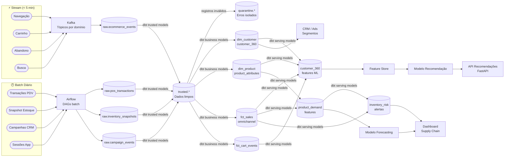

# Fluxo de Dados — Plataforma de Dados para Retail de Beleza

Detalhe do fluxo de dados desde as fontes até os consumidores finais, com tipos de ingestão e latências.

---

## Diagrama de Fluxo

---

## Latências por Tipo de Dado

| Dado | Tipo de Ingestão | Latência Alvo |
|---|---|---|
| Eventos de navegação e carrinho | Stream (Kafka) | < 5 minutos |
| Transações de e-commerce | Stream (Kafka) | < 5 minutos |
| Transações PDV físico | Batch CDC (Airflow) | < 4 horas |
| Snapshot de estoque | Batch (Airflow) | < 2 horas |
| Campanhas CRM | Batch (Airflow) | Diário |
| Sessões app mobile | Batch API (Airflow) | < 4 horas |
| Features de ML (serving) | dbt após ingestão | T + 30 min |
| Segmentos RFM | Airflow semanal | Semanal |
| Forecasts de demanda | Airflow semanal | Semanal |
