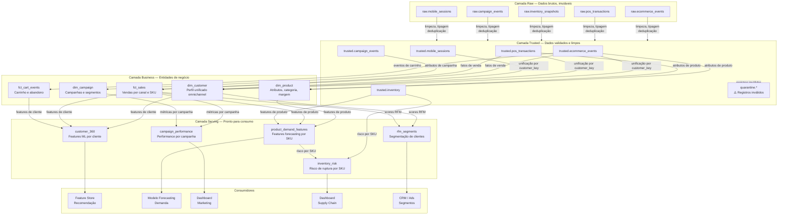

# Camadas de Modelagem dbt — Plataforma de Dados para Retail de Beleza

Detalhe das camadas de transformação gerenciadas pelo dbt, com responsabilidades e exemplos de modelos.

---

## Diagrama de Camadas



---

## Contrato de Qualidade por Camada

| Camada | Testes Obrigatórios | Ação em Falha |
|---|---|---|
| **trusted** | `not_null` em PKs e datas; `unique` em PKs; `accepted_values` em enums | Mover para quarentena; não promover para business |
| **business** | `relationships` entre fatos e dims; `not_null` em FKs; `unique` em PKs | Falhar o pipeline; alertar #data-quality |
| **serving** | `row_count_anomaly`; `not_null` em todas as features; range de valores | Falhar o pipeline; bloquear update na feature store |

---

## Exemplos de Modelos dbt

### `dim_customer` — Perfil unificado omnichannel

```sql
-- models/business/dim_customer.sql
-- Unifica o cliente entre e-commerce, PDV e app com resolução de entidade por e-mail/CPF
SELECT
    COALESCE(ec.customer_id, pos.customer_id)           AS customer_id,
    COALESCE(ec.email, pos.email)                       AS email,
    COALESCE(ec.cpf_hash, pos.cpf_hash)                 AS cpf_hash,
    COALESCE(ec.first_name, pos.first_name)             AS first_name,
    MIN(COALESCE(ec.created_at, pos.created_at))        AS customer_since,
    CASE
        WHEN ec.customer_id IS NOT NULL
         AND pos.customer_id IS NOT NULL THEN 'omnichannel'
        WHEN ec.customer_id IS NOT NULL  THEN 'digital_only'
        ELSE 'physical_only'
    END                                                  AS channel_profile
FROM trusted.ecommerce_customers ec
FULL OUTER JOIN trusted.pos_customers pos
    ON ec.cpf_hash = pos.cpf_hash
    OR ec.email = pos.email
```

### `inventory_risk` — Risco de ruptura

```sql
-- models/serving/inventory_risk.sql
-- Identifica SKUs com risco de ruptura baseado em estoque atual e previsão de demanda
SELECT
    i.sku_id,
    i.current_stock,
    f.forecast_30d,
    i.reorder_point,
    CASE
        WHEN i.current_stock < f.forecast_30d * 0.15 THEN 'critical'
        WHEN i.current_stock < f.forecast_30d * 0.30 THEN 'warning'
        ELSE 'ok'
    END                                   AS risk_level,
    ROUND(i.current_stock / NULLIF(f.daily_avg_demand, 0)) AS days_of_stock
FROM trusted.inventory i
LEFT JOIN serving.product_demand_features f USING (sku_id)
```
