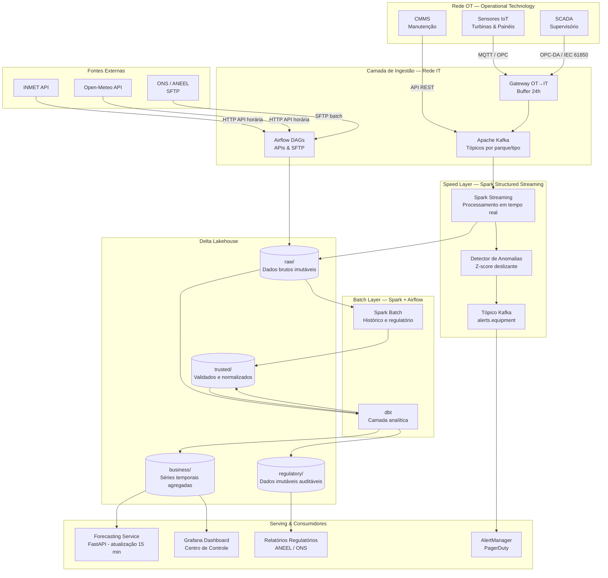
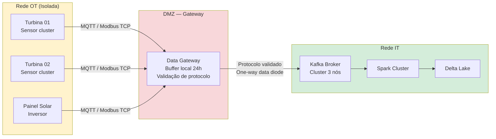

# Arquitetura Geral — Plataforma de Dados para Energia Renovável

Visão de alto nível da arquitetura Lambda híbrida, com separação entre speed layer (streaming) e batch layer, e zona regulatória isolada.

---

## Diagrama de Arquitetura

---

## Separação OT / IT e Controles de Segurança

---

## Responsabilidades por Componente

| Componente | Responsabilidade | Tecnologia |
|---|---|---|
| **Kafka** | Barramento de telemetria de alta frequência com replay e durabilidade | Apache Kafka (RF=3) |
| **Spark Streaming** | Processamento de telemetria em tempo real; detecção de anomalias | Spark Structured Streaming |
| **Spark Batch** | Processamento histórico; agregações; reprocessamento regulatório | Apache Spark (PySpark) |
| **Airflow** | Orquestração de ingestão de APIs externas, retreinamento de modelos, relatórios | Apache Airflow |
| **Delta Lake** | Armazenamento com ACID transactions, time travel e schema evolution | Delta Lake / S3-compatible |
| **dbt** | Modelagem analítica com testes de qualidade e lineage | dbt (Spark adapter) |
| **Forecasting Service** | Serving de previsões de geração com atualização a cada 15 min | Python / FastAPI + MLflow |
| **Grafana** | Dashboard operacional do Centro de Controle | Grafana + Prometheus |
| **AlertManager** | Roteamento de alertas por severidade e equipe responsável | AlertManager + PagerDuty |
