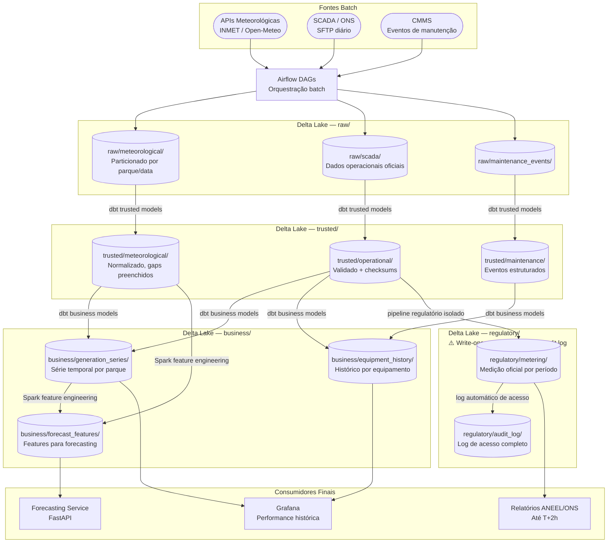

# Fluxo de Dados — Plataforma de Dados para Energia Renovável

Detalhe do fluxo de dados separado por velocidade de ingestão, com SLAs e destinos para cada tipo de dado.

---

## Diagrama de Fluxo — Speed Layer (Streaming)

```mermaid
flowchart LR
    subgraph SENSORS["Sensores IoT (~500/parque)"]
        T1([Potência gerada\nMW])
        T2([Tensão / Corrente\nkV / A])
        T3([Temperatura\n°C])
        T4([Vibração\nm/s²])
        T5([Irradiância\nW/m²])
    end

    KAFKA_TELEM[Kafka\ntopic: telemetry.{parque_id}]
    KAFKA_ALERTS[Kafka\ntopic: alerts.equipment]

    SPARK_STREAM[Spark Structured Streaming\nJanela deslizante 7 dias]

    ANOMALY{Z-score\n> 3.0?}

    RAW_TELEM[(Delta Lake\nraw/telemetry/)]
    TRUSTED_TELEM[(Delta Lake\ntrusted/telemetry/\nnormalizado + flags)]

    GRAFANA[Grafana\nCentro de Controle\n< 30s latência]
    PAGERDUTY[AlertManager\nPagerDuty\nEquipe Manutenção]

    T1 & T2 & T3 & T4 & T5 --> KAFKA_TELEM
    KAFKA_TELEM --> SPARK_STREAM
    SPARK_STREAM --> RAW_TELEM
    SPARK_STREAM --> ANOMALY
    ANOMALY -->|sim| KAFKA_ALERTS
    ANOMALY -->|não| TRUSTED_TELEM
    KAFKA_ALERTS --> PAGERDUTY
    TRUSTED_TELEM --> GRAFANA
```

---

## Diagrama de Fluxo — Batch Layer



---

## SLAs por Tipo de Dado

| Dado | Frequência de Ingestão | SLA de Disponibilidade | Zona de Destino |
|---|---|---|---|
| Telemetria de sensores | Contínua (1 leitura/min por sensor) | < 30 segundos no dashboard | trusted/telemetry/ |
| Alertas de anomalia | Em tempo real | < 60 segundos para PagerDuty | Kafka topic → AlertManager |
| Previsão meteorológica | A cada hora | < 5 min após publicação da API | raw/meteorological/ |
| Dados SCADA operacionais | A cada 15 min | < 30 min | raw/scada/ |
| Features de forecasting | A cada 15 min (pipeline Airflow) | T + 15 min | business/forecast_features/ |
| Forecasts de geração publicados | A cada 15 min | T + 5 min após atualização de features | Kafka + Grafana |
| Dados de medição oficial | Por período de competência | Disponível para regulatory/ imediatamente | regulatory/metering/ |
| Relatórios regulatórios | Por período de competência | T + 2 horas do fim do período | Output ANEEL/ONS |
