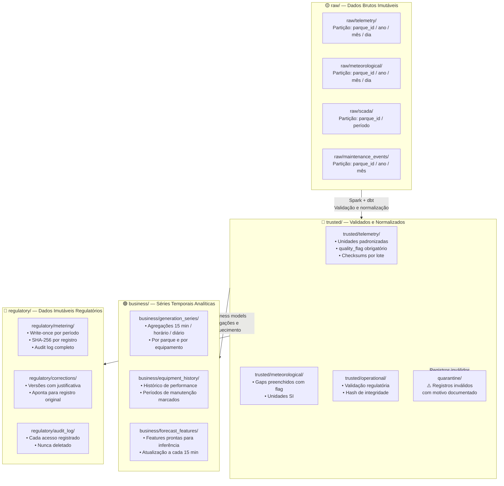

# Zonas do Lakehouse — Plataforma de Dados para Energia Renovável

Detalhe das zonas do Delta Lakehouse com responsabilidades, controles e exemplos de schemas.

---

## Diagrama de Zonas



---

## Controles por Zona

| Zona | Imutabilidade | Hash de Integridade | Audit Log | Retenção | Acesso |
|---|---|---|---|---|---|
| **raw/** | Imutável (append-only) | Por arquivo | Não | 5 anos | Engenharia de dados |
| **trusted/** | Imutável após validação | Por lote | Não | 5 anos | Engenharia + Analistas |
| **business/** | Recomputável via reprocessamento | Não | Não | 3 anos | Amplo (read-only) |
| **regulatory/** | Write-once por período | Por registro (SHA-256) | Sim (completo) | 7 anos | Restrito + auditado |

---

## Schemas Ilustrativos

### `trusted/telemetry/` — Leitura de sensor validada

```
Campo                  Tipo          Descrição
─────────────────────────────────────────────────────────────────
parque_id              STRING        Identificador do parque
equipment_id           STRING        Identificador do equipamento
sensor_type            STRING        Tipo: power_kw / voltage_kv / temp_c / vibration
event_timestamp        TIMESTAMP     Timestamp da leitura (UTC)
value                  DOUBLE        Valor medido em unidade padrão SI
quality_flag           STRING        valid / estimated / suspect / missing
zscore                 DOUBLE        Z-score calculado na janela deslizante de 7 dias
is_anomaly             BOOLEAN       True se |zscore| > 3.0
ingestion_timestamp    TIMESTAMP     Timestamp de chegada no pipeline (UTC)
source_system          STRING        Identificador do gateway de origem
_batch_id              STRING        ID do lote de processamento para rastreabilidade
```

### `regulatory/metering/` — Medição oficial com controles

```
Campo                  Tipo          Descrição
─────────────────────────────────────────────────────────────────
parque_id              STRING        Identificador do parque
regulatory_period      TIMESTAMP     Início do período de competência (UTC)
measured_kwh           DOUBLE        Energia medida no período (kWh)
programmed_kwh         DOUBLE        Energia programada junto ao ONS (kWh)
quality_flag           STRING        valid / estimated — nunca omitido
record_hash            STRING        SHA-256 do registro original (imutável)
ingestion_timestamp    TIMESTAMP     Timestamp de recebimento (UTC)
source_system          STRING        Sistema de medição oficial (ex: SMED/ANEEL)
pipeline_version       STRING        Git commit hash do pipeline de ingestão
audit_user             STRING        Identidade do processo que escreveu o registro
corrects_record_hash   STRING        NULL ou hash do registro corrigido (se for correção)
correction_reason      STRING        Justificativa obrigatória se corrects_record_hash != NULL
```

---

## Time Travel para Auditoria

O Delta Lake mantém o histórico completo de versões de cada tabela. Isso permite que equipes de compliance acessem o estado exato de qualquer tabela em qualquer ponto no tempo:

```sql
-- Exemplo ilustrativo: consultar dados regulatórios como estavam em uma data específica
SELECT *
FROM regulatory.metering
TIMESTAMP AS OF '2025-12-31 23:59:59'
WHERE parque_id = 'PARQUE_SOLAR_NE_01'
  AND regulatory_period BETWEEN '2025-12-01' AND '2025-12-31'
ORDER BY regulatory_period;
```

Isso é particularmente crítico para responder a questionamentos regulatórios retroativos, onde o auditor precisa verificar os dados exatamente como estavam disponíveis em um período específico — independentemente de correções ou atualizações posteriores.
